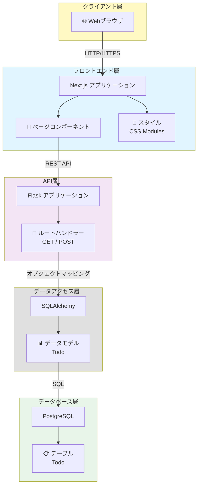
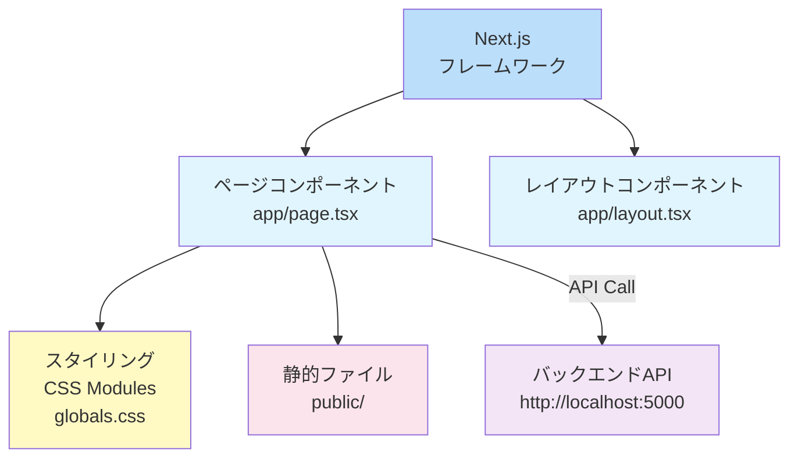
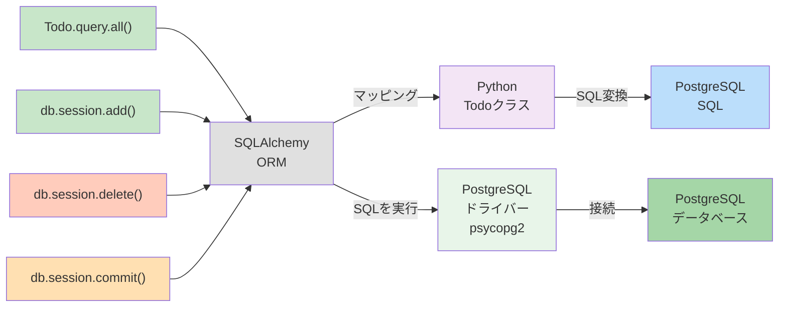
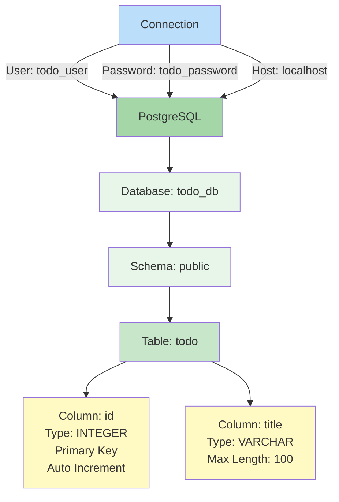
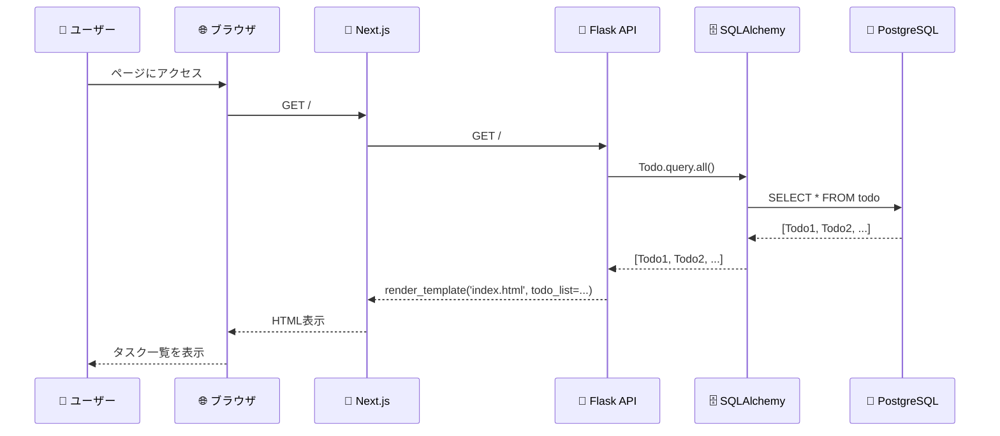
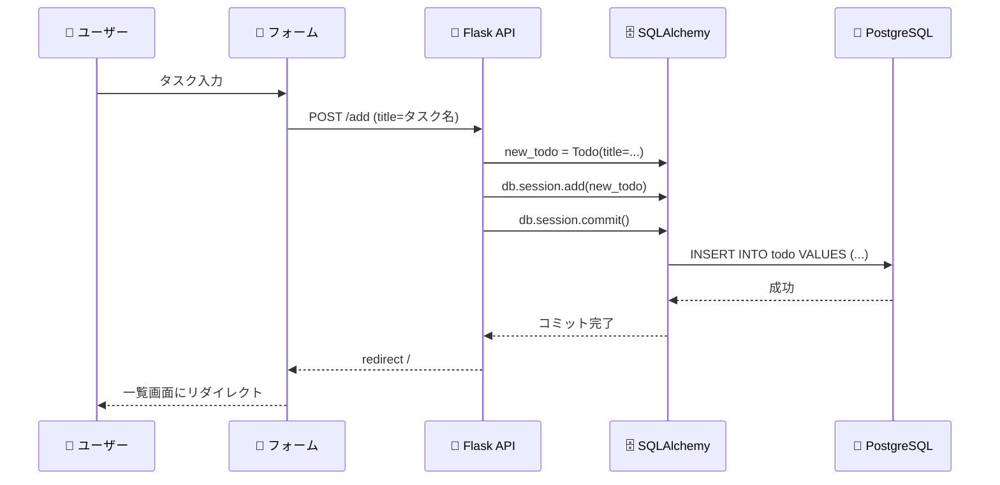
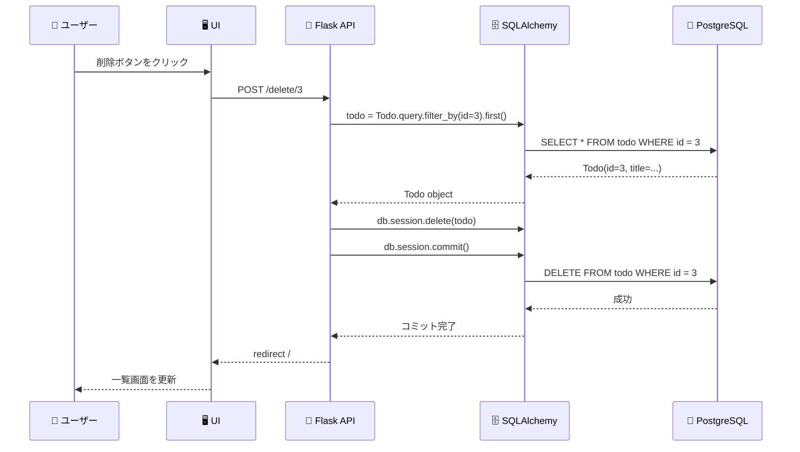
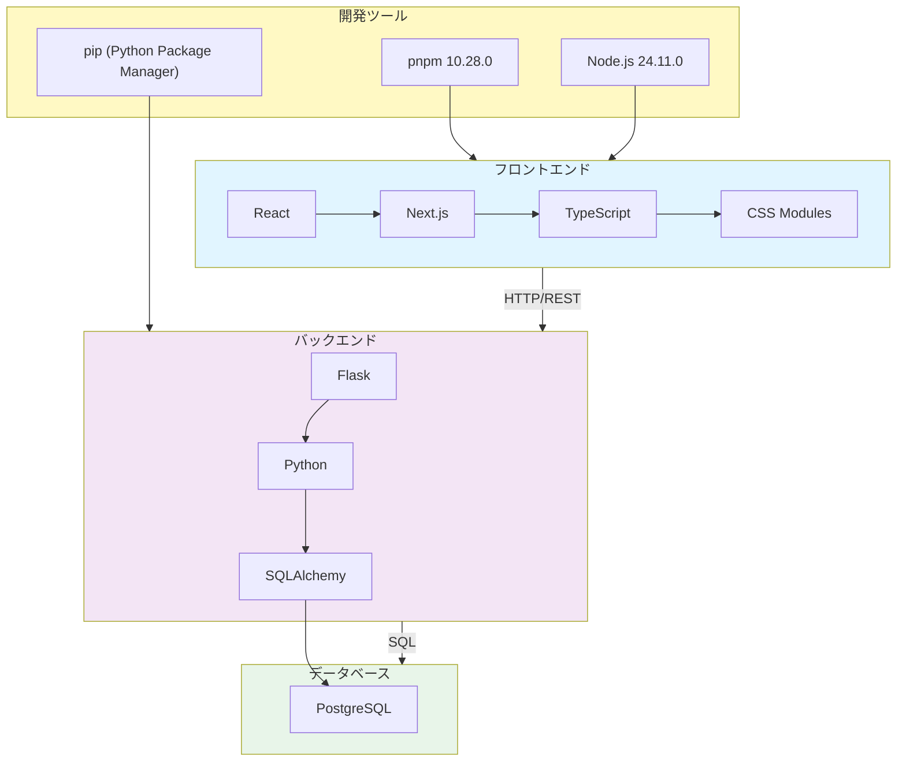
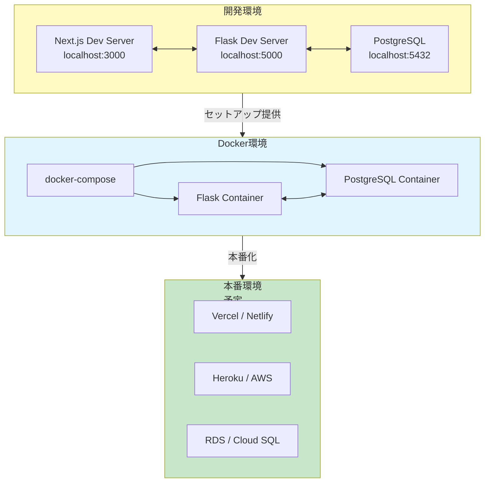
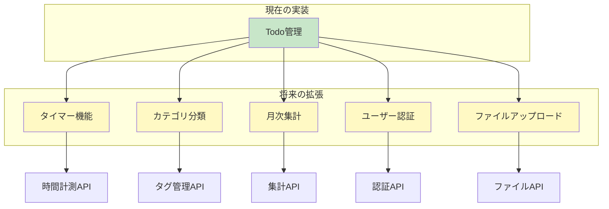

# ItCol 月次作業報告ツール - アーキテクチャドキュメント

## システムアーキテクチャ全体図



---

## レイヤー別詳細設計

### 1. フロントエンド層 (Frontend)



**責務**:

- ユーザーインターフェース提供
- タスク入力フォーム
- タスク一覧表示
- レスポンシブデザイン

**技術スタック**:

- React + Next.js
- TypeScript
- CSS Modules

---

### 2. API層 (Flask Backend)

```mermaid
graph TD
    A["Flask アプリケーション<br/>app.py"] --> B["GET /"
    タスク一覧表示"]
    A --> C["POST /add<br/>タスク追加"]
    A --> D["POST /delete/<id><br/>タスク削除"]

    B --> E["SQLAlchemy<br/>Todo.query.all"]
    C --> F["SQLAlchemy<br/>Todo追加"]
    D --> G["SQLAlchemy<br/>Todo削除"]

    H["render_template<br/>index.html"] <--> B
    I["redirect<br/>home"] <--> C
    J["redirect<br/>home"] <--> D

    style A fill:#f3e5f5
    style B fill:#ffe0b2
    style C fill:#c8e6c9
    style D fill:#ffccbc
    style E fill:#e0e0e0
    style F fill:#e0e0e0
    style G fill:#e0e0e0
    style H fill:#fff9c4
    style I fill:#fff9c4
    style J fill:#fff9c4
```

**エンドポイント**:

| メソッド | URL          | 処理             | レスポンス        |
| -------- | ------------ | ---------------- | ----------------- |
| GET      | /            | タスク一覧を取得 | HTML (index.html) |
| POST     | /add         | 新規タスクを追加 | リダイレクト      |
| POST     | /delete/<id> | タスクを削除     | リダイレクト      |

**フロー**:

1. リクエスト受信
2. SQLAlchemy でデータベース操作
3. テンプレートにレンダリングまたはリダイレクト

---

### 3. データアクセス層 (SQLAlchemy ORM)



**主要なメソッド**:

- `Todo.query.all()` - 全タスクを取得
- `db.session.add(todo)` - タスクを追加
- `db.session.delete(todo)` - タスクを削除
- `db.session.commit()` - 変更を確定

---

### 4. データベース層 (PostgreSQL)



**テーブル設計**:

```sql
CREATE TABLE todo (
    id INTEGER PRIMARY KEY AUTOINCREMENT,
    title VARCHAR(100) NOT NULL
);
```

**接続情報**:

```
Host: localhost
Database: todo_db
User: todo_user
Password: todo_password
Port: 5432 (デフォルト)
```

---

## データフロー

### ユースケース1: タスク一覧表示



### ユースケース2: タスク追加



### ユースケース3: タスク削除



---

## 技術スタック全体図



---

## デプロイメント構成



---

## 環境変数設定

### バックエンド環境変数

```
USE_POSTGRESQL=1                    # PostgreSQL使用フラグ
FLASK_ENV=development               # 開発環境
FLASK_DEBUG=True                    # デバッグモード

# PostgreSQL接続情報
DB_USER=todo_user
DB_PASSWORD=todo_password
DB_HOST=localhost
DB_PORT=5432
DB_NAME=todo_db
```

---

## 今後の拡張性

### 新機能追加時のアーキテクチャ拡張



---

**最終更新日**: 2026年2月2日
