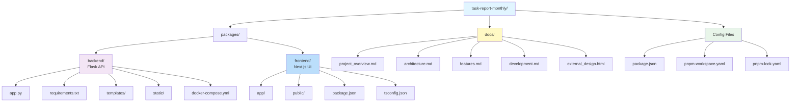
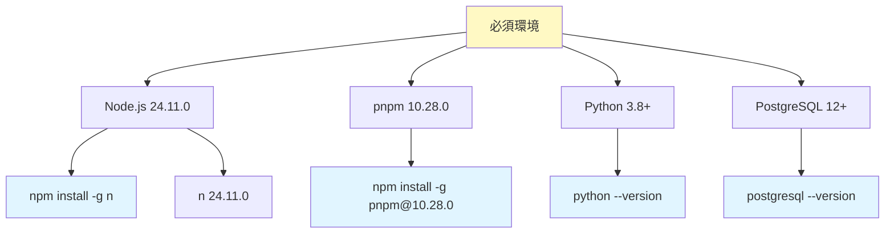
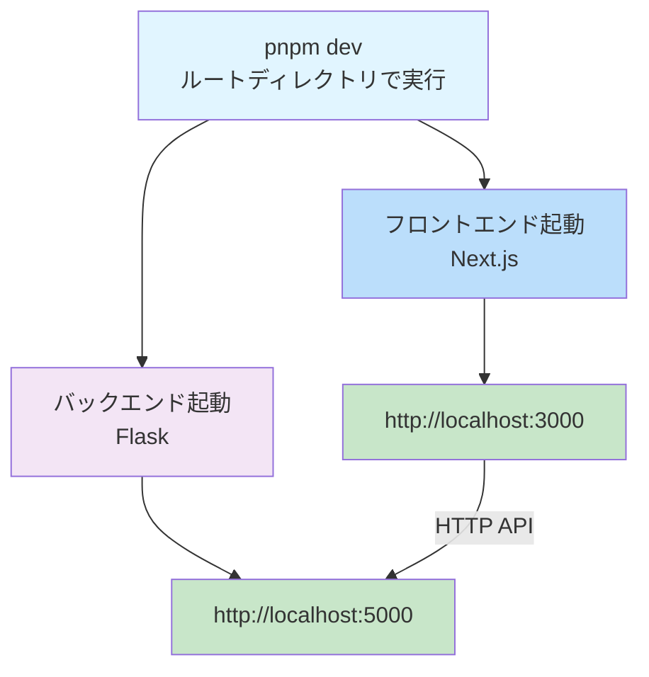
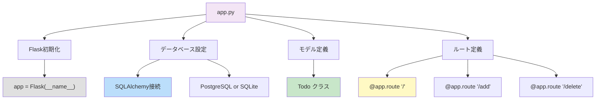
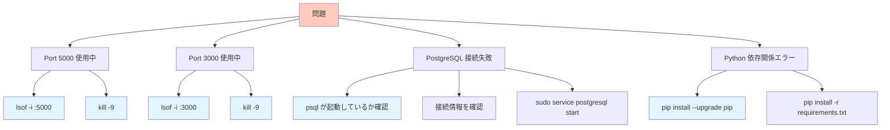
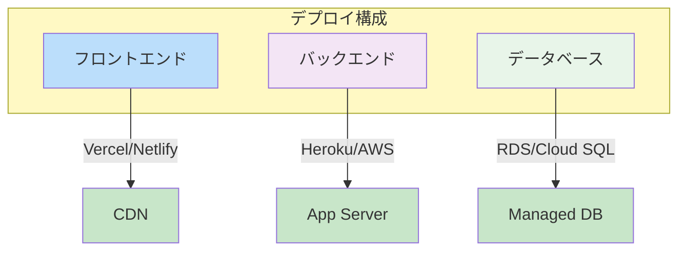
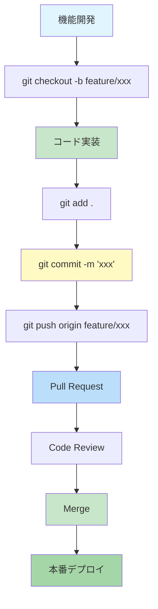

# ItCol 月次作業報告ツール - 開発ガイド

## プロジェクト構成図



---

## ローカル開発環境セットアップ

### 前提条件



### インストール手順

#### ステップ1: リポジトリ準備

```bash
# 1. ディレクトリ移動
cd /home/masapo/PycharmProjects/task-report-monthly

# 2. 依存関係インストール (monorepo全体)
pnpm install
```

#### ステップ2: バックエンド設定

```bash
# 1. バックエンドディレクトリに移動
cd packages/backend

# 2. PostgreSQL セットアップ (どれか1つ選択)

# Option A: Linux/Mac の場合
./setup.sh

# Option B: Windows の場合
.\setup_windows.ps1

# Option C: Docker の場合
./setup_docker.sh

# Option D: WSL の場合
./setup_wsl.sh

# 3. Python依存関係インストール
pip install -r requirements.txt

# 4. バックエンド起動テスト
USE_POSTGRESQL=1 python app.py
# http://localhost:5000 でアクセス可能になる
```

#### ステップ3: フロントエンド設定

```bash
# 1. フロントエンドディレクトリに移動
cd packages/frontend

# 2. 依存関係インストール
pnpm install

# 3. 開発サーバー起動
pnpm dev
# http://localhost:3000 でアクセス可能になる
```

---

## 開発ワークフロー

### 統合開発サーバー起動



### ホットリロード

```bash
# ルートディレクトリから
pnpm dev

# または個別起動
pnpm backend:dev    # Flask: http://localhost:5000
pnpm frontend:dev   # Next.js: http://localhost:3000
```

---

## バックエンド開発ガイド

### ファイル構成

```
packages/backend/
├── app.py                      # メインアプリケーション
├── requirements.txt            # Python依存関係
├── templates/
│   └── index.html             # HTML テンプレート
├── static/
│   └── style.css              # スタイルシート
├── docker-compose.yml         # Docker設定
└── setup*.sh                  # セットアップスクリプト
```

### 主要なファイル説明

#### app.py - メインアプリケーション



### APIエンドポイント開発

#### 新規エンドポイント追加例

```python
# app.py に以下を追加

@app.route("/api/tasks", methods=["GET"])
def get_tasks_json():
    """JSON形式でタスク一覧を返す"""
    todos = Todo.query.all()
    return {
        'success': True,
        'data': [{'id': t.id, 'title': t.title} for t in todos]
    }

@app.route("/api/tasks/<int:task_id>", methods=["GET"])
def get_task(task_id):
    """特定のタスクを取得"""
    todo = Todo.query.get(task_id)
    if todo is None:
        return {'error': 'Not found'}, 404
    return {'id': todo.id, 'title': todo.title}

@app.route("/api/tasks/<int:task_id>", methods=["PUT"])
def update_task(task_id):
    """タスクを更新"""
    todo = Todo.query.get(task_id)
    if todo is None:
        return {'error': 'Not found'}, 404

    data = request.get_json()
    if 'title' in data:
        todo.title = data['title']

    db.session.commit()
    return {'success': True, 'id': todo.id, 'title': todo.title}
```

### モデル拡張例

```python
# 将来のカテゴリ機能追加時

class Category(db.Model):
    id = db.Column(db.Integer, primary_key=True)
    name = db.Column(db.String(50), unique=True)
    todos = db.relationship('Todo', backref='category')

class Todo(db.Model):
    id = db.Column(db.Integer, primary_key=True)
    title = db.Column(db.String(100))
    category_id = db.Column(db.Integer, db.ForeignKey('category.id'))
    time_spent = db.Column(db.Integer)  # 秒単位
    created_at = db.Column(db.DateTime, default=datetime.now)
```

---

## フロントエンド開発ガイド

### ファイル構成

```
packages/frontend/
├── app/                        # App Router
│   ├── page.tsx               # トップページ
│   ├── layout.tsx             # ルートレイアウト
│   └── globals.css            # グローバルスタイル
├── public/                    # 静的ファイル
├── package.json               # 依存関係
├── tsconfig.json              # TypeScript設定
├── next.config.ts             # Next.js設定
└── pnpm-lock.yaml
```

### ページ開発例

#### タスク入力フォーム (page.tsx)

```typescript
'use client';

import { useState } from 'react';
import styles from './page.module.css';

interface Todo {
  id: number;
  title: string;
}

export default function Home() {
  const [todos, setTodos] = useState<Todo[]>([]);
  const [input, setInput] = useState('');

  // タスク追加
  const addTodo = async (e: React.FormEvent) => {
    e.preventDefault();

    const formData = new FormData();
    formData.append('title', input);

    try {
      const response = await fetch('http://localhost:5000/add', {
        method: 'POST',
        body: formData
      });

      if (response.ok) {
        setInput('');
        // 一覧を再取得
        fetchTodos();
      }
    } catch (error) {
      console.error('Error:', error);
    }
  };

  // タスク一覧取得
  const fetchTodos = async () => {
    try {
      const response = await fetch('http://localhost:5000/');
      const data = await response.text();
      // HTMLをパースしてTodoを抽出
    } catch (error) {
      console.error('Error:', error);
    }
  };

  return (
    <div className={styles.page}>
      <h1>ItCol 月次作業報告ツール</h1>

      <form onSubmit={addTodo}>
        <input
          type="text"
          value={input}
          onChange={(e) => setInput(e.target.value)}
          placeholder="タスクを入力..."
        />
        <button type="submit">追加</button>
      </form>

      <ul>
        {todos.map(todo => (
          <li key={todo.id}>{todo.title}</li>
        ))}
      </ul>
    </div>
  );
}
```

---

## データベース操作ガイド

### PostgreSQL接続確認

```bash
# PostgreSQL ログイン
psql -U todo_user -d todo_db -h localhost

# 基本コマンド
\dt                 # テーブル一覧表示
\d todo             # todoテーブル構造表示
SELECT * FROM todo; # データ表示

# テスト用データ挿入
INSERT INTO todo (title) VALUES ('テストタスク');

# 終了
\q
```

### マイグレーション例

```python
# migration_2024_02_02.py

from sqlalchemy import Column, String, Integer, DateTime, ForeignKey
from datetime import datetime

def upgrade():
    """テーブル構造を更新"""

    # カテゴリテーブル作成
    """
    CREATE TABLE category (
        id INTEGER PRIMARY KEY AUTO_INCREMENT,
        name VARCHAR(50) NOT NULL UNIQUE
    );
    """

    # todoテーブルに列追加
    """
    ALTER TABLE todo ADD COLUMN category_id INTEGER;
    ALTER TABLE todo ADD COLUMN time_spent INTEGER DEFAULT 0;
    ALTER TABLE todo ADD COLUMN created_at TIMESTAMP DEFAULT CURRENT_TIMESTAMP;
    ALTER TABLE todo ADD FOREIGN KEY (category_id) REFERENCES category(id);
    """

def downgrade():
    """ロールバック"""
    """
    ALTER TABLE todo DROP FOREIGN KEY;
    ALTER TABLE todo DROP COLUMN category_id;
    ALTER TABLE todo DROP COLUMN time_spent;
    ALTER TABLE todo DROP COLUMN created_at;
    DROP TABLE category;
    """
```

---

## デバッグとトラブルシューティング

### よくある問題と解決方法



### ログ確認

```bash
# バックエンドログ
cd packages/backend
python app.py 2>&1 | tee app.log

# フロントエンドログ
cd packages/frontend
pnpm dev 2>&1 | tee frontend.log

# PostgreSQL ログ
sudo tail -f /var/log/postgresql/postgresql-*.log
```

---

## テスト方法

### バックエンド テスト

```bash
cd packages/backend

# 単体テスト例
python -m pytest tests/test_models.py

# API テスト
curl -X POST http://localhost:5000/add \
  -d "title=Test Task"

curl http://localhost:5000/
```

### フロントエンド テスト

```bash
cd packages/frontend

# 静的チェック
pnpm lint

# ユニットテスト
pnpm test

# ビルドテスト
pnpm build
```

---

## ビルドとデプロイ

### ビルドコマンド

```bash
# 全パッケージ
pnpm build

# バックエンドのみ
pnpm -F backend build

# フロントエンドのみ
pnpm -F frontend build
```

### 本番環境構成



---

## コード品質

### Linting

```bash
# ESLint (フロントエンド)
cd packages/frontend
pnpm lint

# 自動修正
pnpm lint -- --fix
```

### フォーマッティング

```bash
# Prettier (TypeScript/CSS)
pnpm format

# 確認のみ
pnpm format:check
```

---

## Git ワークフロー



---

## 参考資料

### 公式ドキュメント

- [Next.js Documentation](https://nextjs.org/docs)
- [Flask Documentation](https://flask.palletsprojects.com/)
- [SQLAlchemy Documentation](https://docs.sqlalchemy.org/)
- [PostgreSQL Documentation](https://www.postgresql.org/docs/)

### 関連ドキュメント

- [project_overview.md](project_overview.md) - プロジェクト概要
- [architecture.md](architecture.md) - システムアーキテクチャ
- [features.md](features.md) - 機能仕様

---

**最終更新日**: 2026年2月2日
