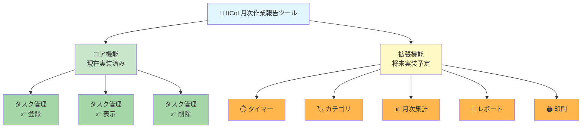
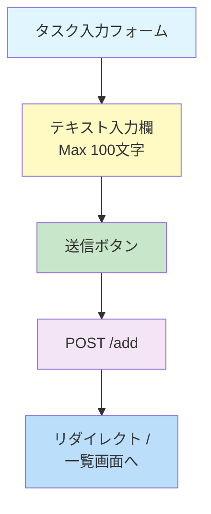
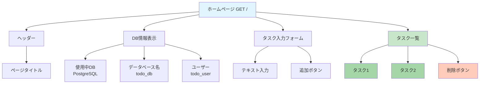
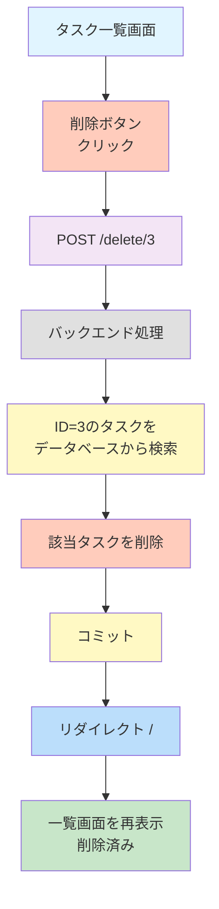
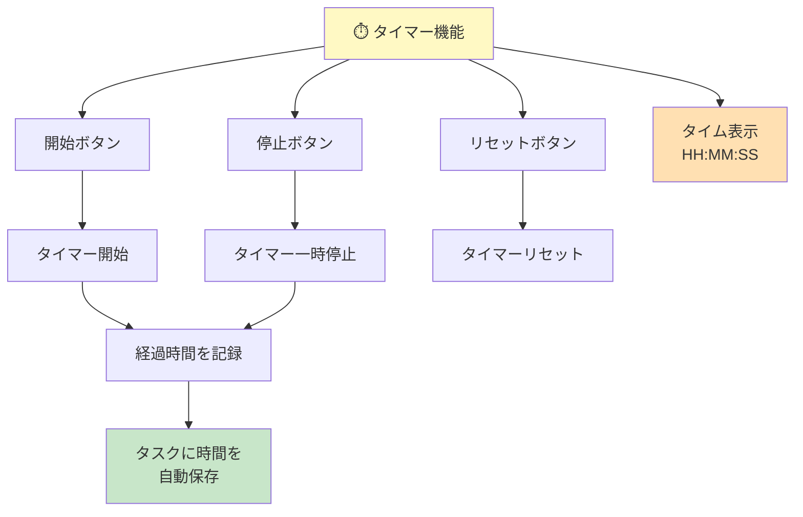
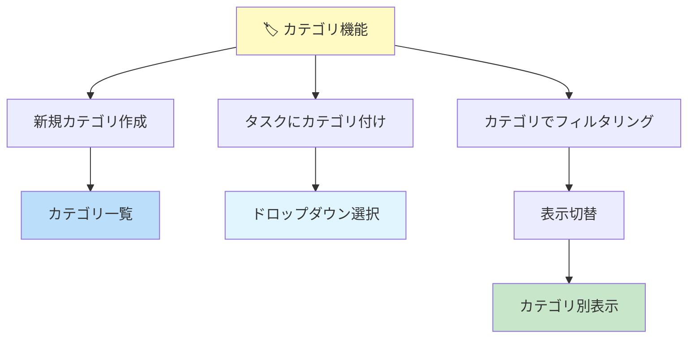
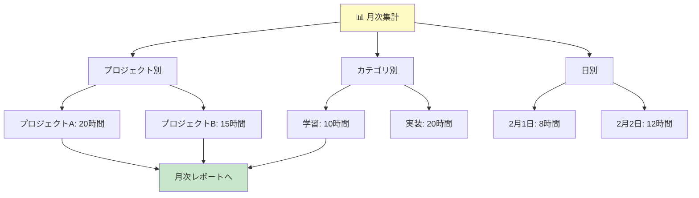
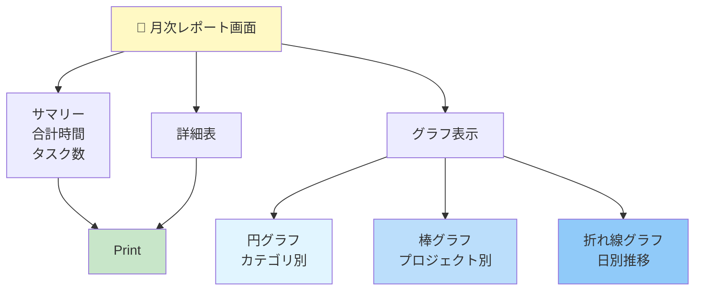
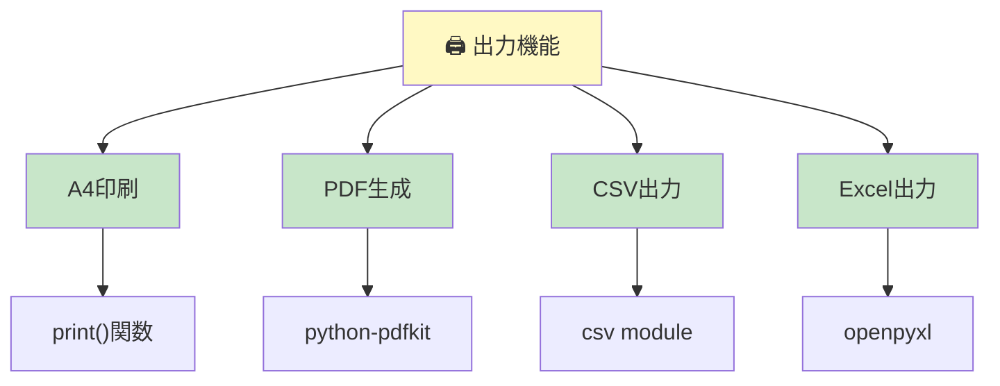
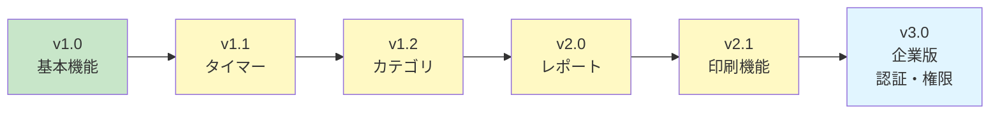

# ItCol 月次作業報告ツール - 機能仕様書

## 機能概要図



---

## ✅ 実装済み機能

### 1. タスク登録機能

```
機能名: タスク新規登録
ステータス: ✅ 実装完了
エンドポイント: POST /add
対応URL: /add
```

**入力画面**:



**処理フロー**:

1. ユーザーがフォームにタスク名を入力
2. 「追加」ボタンをクリック
3. `POST /add` リクエストを送信
4. バックエンド: 新しい `Todo` オブジェクトを作成
5. データベースに保存（INSERT）
6. 確認後、一覧画面にリダイレクト

**データベース処理**:

```python
# app.py内のコード
@app.route("/add", methods=["POST"])
def add():
    title = request.form.get("title")        # フォーム値取得
    new_todo = Todo(title=title)             # Todoオブジェクト作成
    db.session.add(new_todo)                 # セッションに追加
    db.session.commit()                      # データベースコミット
    return redirect(url_for("home"))         # ホームにリダイレクト
```

---

### 2. タスク一覧表示機能

```
機能名: タスク一覧表示
ステータス: ✅ 実装完了
エンドポイント: GET /
表示URL: /
```

**表示画面構成**:



**処理フロー**:

1. ユーザーがホームページ `/` にアクセス
2. バックエンド: `Todo.query.all()` で全タスクを取得
3. データベースから全レコードを読込
4. テンプレートにデータを渡す
5. HTMLレンダリング
6. ブラウザに表示

**データベース処理**:

```python
# app.py内のコード
@app.route("/", methods=["GET", "POST"])
def home():
    todo_list = Todo.query.all()            # 全タスク取得

    db_info = {
        'type': 'PostgreSQL',
        'database': 'todo_db',
        'user': 'todo_user',
        'host': 'localhost'
    }

    return render_template("index.html", todo_list=todo_list, db_info=db_info)
```

---

### 3. タスク削除機能

```
機能名: タスク削除
ステータス: ✅ 実装完了
エンドポイント: POST /delete/<id>
トリガー: 各タスクの削除ボタン
```

**削除フロー**:



**処理フロー**:

1. ユーザーが削除ボタンをクリック
2. `POST /delete/<id>` リクエストを送信
3. バックエンド: IDで該当タスクを検索
4. 検索結果を取得
5. データベースから削除（DELETE）
6. 変更をコミット
7. 一覧画面にリダイレクト

**データベース処理**:

```python
# app.py内のコード
@app.route("/delete/<int:todo_id>", methods=["POST"])
def delete(todo_id):
    todo = Todo.query.filter_by(id=todo_id).first()  # IDで検索
    db.session.delete(todo)                          # 削除
    db.session.commit()                              # コミット
    return redirect(url_for("home"))                 # ホームへリダイレクト
```

---

## ❌ 未実装機能（開発計画）

### フェーズ2: タイマー機能

```
機能名: タイマー機能
ステータス: ❌ 未実装
優先度: 高
概要: 作業時間の自動計測
```

**予定機能**:



**データベース拡張**:

```sql
ALTER TABLE todo ADD COLUMN time_spent INTEGER;  -- 秒単位
ALTER TABLE todo ADD COLUMN started_at TIMESTAMP;
ALTER TABLE todo ADD COLUMN paused_at TIMESTAMP;
```

---

### フェーズ2: カテゴリ分類機能

```
機能名: カテゴリ分類機能
ステータス: ❌ 未実装
優先度: 中
概要: タスクをカテゴリで分類
```

**予定機能**:



**データベース拡張**:

```sql
CREATE TABLE category (
    id INTEGER PRIMARY KEY AUTO_INCREMENT,
    name VARCHAR(50) NOT NULL
);

ALTER TABLE todo ADD COLUMN category_id INTEGER;
ALTER TABLE todo ADD FOREIGN KEY (category_id)
    REFERENCES category(id) ON DELETE SET NULL;
```

**予定カテゴリ例**:

- 📚 学習
- 💻 実装
- 🧪 テスト
- 📝 ドキュメント
- 🐛 デバッグ
- 📞 会議

---

### フェーズ3: 月次集計機能

```
機能名: 月次集計機能
ステータス: ❌ 未実装
優先度: 高
概要: プロジェクト別、カテゴリ別の集計
```

**予定集計結果**:



**SQL集計例**:

```sql
-- プロジェクト別集計
SELECT project_id, SUM(time_spent)
FROM todo
WHERE DATE_TRUNC('month', created_at) = CURRENT_DATE
GROUP BY project_id;

-- カテゴリ別集計
SELECT category_id, SUM(time_spent)
FROM todo
WHERE DATE_TRUNC('month', created_at) = CURRENT_DATE
GROUP BY category_id;
```

---

### フェーズ3: レポート画面

```
機能名: 月次レポート画面
ステータス: ❌ 未実装
優先度: 高
概要: 月次集計結果をグラフ表示
```

**レポート構成**:



**グラフライブラリ候補**:

- Chart.js
- Recharts
- Plotly.js
- D3.js

---

### フェーズ4: 印刷・エクスポート機能

```
機能名: A4印刷・エクスポート機能
ステータス: ❌ 未実装
優先度: 中
概要: 月次レポートの印刷/出力
```

**出力形式**:



---

## 機能マトリックス

| #   | 機能         | 説明               | ステータス | 優先度 | 難易度 | 工数(h) |
| --- | ------------ | ------------------ | ---------- | ------ | ------ | ------- |
| 1   | タスク登録   | タスクの新規登録   | ✅ 完了    | 必須   | 低     | 1       |
| 2   | タスク一覧   | 登録済みタスク表示 | ✅ 完了    | 必須   | 低     | 1       |
| 3   | タスク削除   | タスクの削除       | ✅ 完了    | 必須   | 低     | 1       |
| 4   | タイマー機能 | 作業時間計測       | ❌ 未実装  | 高     | 中     | 4       |
| 5   | カテゴリ分類 | タスク分類         | ❌ 未実装  | 中     | 中     | 3       |
| 6   | 月次集計     | 集計・分析         | ❌ 未実装  | 高     | 中     | 5       |
| 7   | レポート画面 | グラフ表示         | ❌ 未実装  | 高     | 高     | 6       |
| 8   | 印刷機能     | PDF/Excel出力      | ❌ 未実装  | 中     | 高     | 4       |

---

## 使用例

### 例1: 平日の業務ログ

```
2026年2月2日（月）
┌─────────────────────────────────────────┐
│ 09:00 - タスク登録「〇〇システム調査」    │ → タスク追加
│ 10:00 - タスク登録「△△コード実装」      │ → タスク追加
│ 11:30 - タスク登録「□□テスト実施」      │ → タスク追加
│ 14:00 - 月次集計確認                   │ → レポート表示
│ 16:00 - 報告書出力                     │ → PDF生成・印刷
└─────────────────────────────────────────┘
```

---

## 今後の拡張方針



---

**最終更新日**: 2026年2月2日
