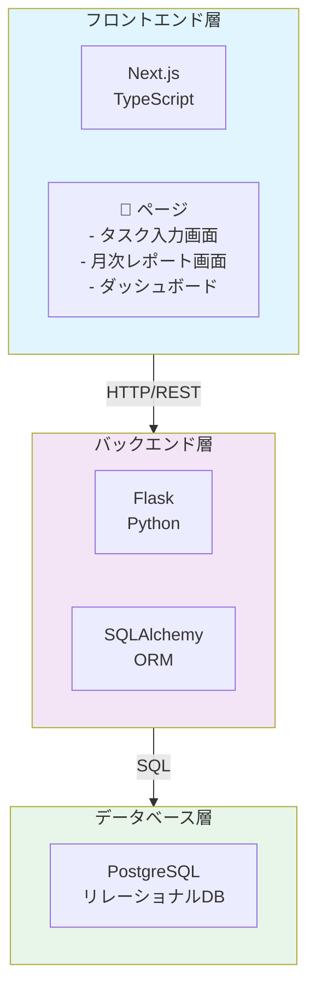
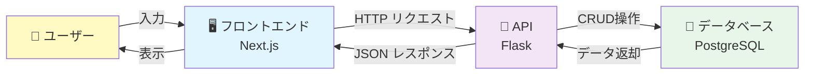

# ItCol 月次作業報告ツール - プロジェクト概要

## 📝 プロジェクト概要

**ItCol月次作業報告ツール**は、IT業務における作業実績を日々記録し、月次で集計・報告するためのWebアプリケーションです。

### 基本情報

- **プロジェクト名**: task-report-monthly
- **種類**: Webアプリケーション（モノレポ構成）
- **対象ユーザー**: IT専門学生、IT業務従事者
- **開発規模**: 6名体制、54人時間（9時間開発）

---

## 🏗️ システムアーキテクチャ



---

## 📦 プロジェクト構成

### ディレクトリ構造

```
task-report-monthly/
├── packages/
│   ├── backend/              ← Flask バックエンド
│   │   ├── app.py            ← メインアプリケーション
│   │   ├── requirements.txt   ← Python依存関係
│   │   ├── templates/        ← HTMLテンプレート
│   │   │   └── index.html
│   │   ├── static/           ← CSS、JS等
│   │   │   └── style.css
│   │   └── docker-compose.yml ← Docker設定
│   │
│   └── frontend/             ← Next.js フロントエンド
│       ├── app/              ← ページコンポーネント
│       │   ├── page.tsx      ← トップページ
│       │   ├── layout.tsx    ← レイアウト
│       │   └── globals.css
│       ├── public/           ← 静的ファイル
│       ├── next.config.ts
│       └── tsconfig.json
│
└── docs/                      ← ドキュメント
    ├── external_design.html   ← 外部設計書
    ├── images/               ← UI参考画像
    └── project_overview.md   ← このファイル
```

### パッケージ情報

**ルートpackage.json**:

- pnpm workspaces によるモノレポ管理
- Node.js: v24.11.0
- pnpm: v10.28.0

**バックエンド依存関係** (`requirements.txt`):

- Flask >= 3.0.0 - Webフレームワーク
- Flask-SQLAlchemy >= 3.1.0 - ORM
- psycopg2-binary >= 2.9.0 - PostgreSQL接続

---

## ✨ 実装状況

### ✅ 完了済み機能

1. **PostgreSQL データベース接続**
   - ローカルPostgreSQLへの接続
   - ユーザー/パスワード認証

2. **基本的なタスク管理機能**
   - タスク登録（POST /add）
   - タスク一覧表示（GET /）
   - タスク削除（POST /delete/<id>）

3. **バックエンド基本構造**
   - Flask + SQLAlchemy による実装
   - Todoモデル定義
   - テンプレートエンジン統合

### ❌ 未実装機能（開発予定）

1. **タイマー機能**
   - 作業時間の自動計測
   - ストップウォッチ機能

2. **カテゴリ分類機能**
   - タスクのカテゴリ付け
   - フィルタリング機能

3. **月次集計機能**
   - プロジェクト別集計
   - カテゴリ別集計
   - 期間別レポート

4. **レポート画面**
   - 月次サマリー表示
   - グラフ化

5. **A4印刷対応**
   - 印刷用レイアウト
   - PDF生成

---

## 🔄 データフロー



### 主要なAPI エンドポイント

| メソッド | エンドポイント | 機能             |
| -------- | -------------- | ---------------- |
| `GET`    | `/`            | タスク一覧を表示 |
| `POST`   | `/add`         | 新規タスクを追加 |
| `POST`   | `/delete/<id>` | タスクを削除     |

---

## 🗄️ データモデル

### Todo テーブル

```
┌─────────────────────────┐
│ Todo                    │
├─────────────────────────┤
│ id (PK)       INTEGER   │
│ title         VARCHAR   │
└─────────────────────────┘
```

**現在の構成**:

- id: 主キー（自動採番）
- title: タスクタイトル

**将来の拡張予定**:

- category_id: カテゴリ外部キー
- project_id: プロジェクト外部キー
- time_spent: 作業時間
- date_created: 作成日時
- date_completed: 完了日時
- status: ステータス

---

## 🚀 セットアップ方法

### 前提条件

- Python 3.x
- PostgreSQL 12以上
- Node.js 24.11.0（推奨）
- pnpm 10.28.0（推奨）

### インストール手順

#### 1. バックエンド セットアップ

```bash
# PostgreSQL セットアップ
cd packages/backend
./setup.sh              # Linux/Mac
# または
.\setup_windows.ps1     # Windows
# または
./setup_docker.sh       # Docker使用

# Python依存関係インストール
pip install -r requirements.txt

# アプリケーション起動
USE_POSTGRESQL=1 python app.py
```

#### 2. フロントエンド セットアップ

```bash
cd packages/frontend

# 依存関係インストール
pnpm install

# 開発サーバー起動
pnpm dev
```

#### 3. 統合起動（ルートディレクトリから）

```bash
# すべてのパッケージを開発モードで起動
pnpm dev

# または個別に起動
pnpm backend:dev
pnpm frontend:dev
```

---

## 📊 開発体制と工数

### チーム構成

- **チームサイズ**: 6名
- **開発期間**: 9時間（1日）
- **合計工数**: 54人時間

### 役割分担

詳細は `docs/external_design.html` の外部設計書を参照してください。

---

## 📚 ドキュメント

### 利用可能なドキュメント

1. **外部設計書** - `docs/external_design.html`
   - システム概要
   - UI仕様
   - データベース設計
   - API設計
   - 工数見積もり
   - 役割分担

2. **セットアップガイド**
   - `packages/backend/SETUP_POSTGRESQL.md` - PostgreSQL セットアップ
   - `packages/backend/setup.sh` - Linux/Mac セットアップスクリプト
   - `packages/backend/setup_docker.sh` - Docker セットアップスクリプト
   - `packages/backend/setup_windows.ps1` - Windows セットアップスクリプト
   - `packages/backend/setup_wsl.sh` - WSL セットアップスクリプト

3. **UI参考画像** - `docs/images/`
   - UI画面のスクリーンショット

---

## 🔧 今後の開発計画

### フェーズ 2: コア機能実装

- [ ] タイマー機能の実装
- [ ] カテゴリ分類機能の実装
- [ ] フロントエンドの充実

### フェーズ 3: レポート機能

- [ ] 月次集計ロジック
- [ ] レポート画面の実装
- [ ] グラフ表示機能

### フェーズ 4: 印刷・エクスポート

- [ ] A4印刷対応
- [ ] PDF生成
- [ ] CSV/Excel エクスポート

---

## 📞 問い合わせ・サポート

詳細な技術情報は、プロジェクトの外部設計書を参照してください。

---

**最終更新日**: 2026年2月2日
